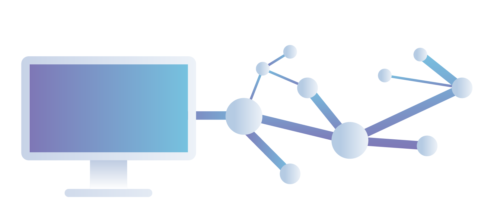
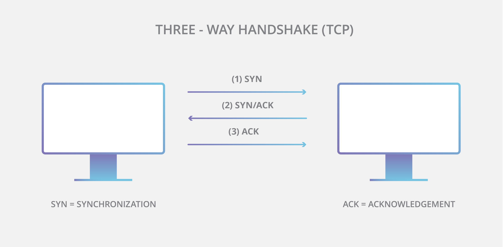

# Введение в WEB

## Что такое сеть?
Сеть — это группа из двух или более подключенных вычислительных устройств. Обычно все устройства в сети подключены к центральному концентратору, например, к маршрутизатору.

## Что происходит на сетевом уровне?
Все, что связано с межсетевыми соединениями, происходит на сетевом уровне. Это включает настройку маршрутов для пакетов данных, проверку работоспособности сервера в другой сети, а также адресацию и получение IP-пакетов из других сетей. Этот последний процесс, пожалуй, самый важный, поскольку подавляющее большинство интернет-трафика отправляется по IP.

## Что такое пакет?
Все данные, отправляемые через Интернет, разбиваются на более мелкие фрагменты, называемые «пакетами». Например, когда Боб посылает Алисе сообщение, его сообщение разбивается на более мелкие части, а затем снова собирается на компьютере Алисы. Пакет состоит из двух частей: заголовка, содержащего информацию о самом пакете, и тела, представляющего собой отправляемые данные.

## Что такое модель OSI?
Модель взаимодействия открытых систем (OSI) — это описание того, как работает Интернет. Он разбивает функции, связанные с отправкой данных через Интернет, на семь уровней. Каждый уровень имеет некоторую функцию, которая подготавливает данные для отправки по проводам, кабелям и радиоволнам в виде последовательности битов.

### Семь уровней модели OSI:

7. Прикладной уровень: данные, генерируемые программными приложениями и используемые ими. Основным протоколом, используемым на этом уровне, является HTTP.
6. Уровень представления: данные переводятся в форму, которую может принять приложение. Некоторые специалисты считают, что на этом уровне происходит шифрование и дешифрование HTTPS.
5. Сеансовый уровень: контролирует соединения между компьютерами (это также может обрабатываться на уровне 4 по протоколу TCP).
4. Транспортный уровень: предоставляет средства для передачи данных между двумя подключенными сторонами, а также для контроля качества обслуживания. Основные используемые здесь протоколы — TCP и UDP.
3. Сетевой уровень: обрабатывает маршрутизацию и отправку данных между различными сетями. Наиболее важными протоколами на этом уровне являются IP и ICMP.
2. Уровень канала передачи данных. Обрабатывает связь между устройствами в одной сети. Если слой 3 похож на адрес в почтовом письме, то слой 2 подобен указанию номера офиса или номера квартиры по этому адресу. Ethernet - это протокол, который сейчас используется здесь.
1. Физический уровень. Пакеты преобразуются в электрические, радио- или оптические импульсы и передаются в виде битов (наименьших возможных единиц информации) по проводам, радиоволнам или кабелям.

Важно иметь в виду, что модель OSI представляет собой абстрактную концептуализацию процессов, обеспечивающих работу Интернета, а интерпретация и применение модели к реальному Интернету иногда является субъективным упражнением.

## Модель OSI по сравнению с TCP/IP модель
Модель TCP/IP — это альтернативная модель работы Интернета. Он делит вовлеченные процессы на четыре слоя вместо семи. Кто-то может возразить, что модель TCP/IP лучше отражает то, как работает Интернет сегодня, но модель OSI по-прежнему широко используется для понимания Интернета, и обе модели имеют свои сильные и слабые стороны.

В модели TCP/IP четыре уровня:

4. Прикладной уровень: примерно соответствует уровню 7 в модели OSI.
3. Транспортный уровень: соответствует уровню 4 в модели OSI.
2. Интернет-уровень: соответствует уровню 3 в модели OSI.
1. Уровень доступа к сети: объединяет процессы уровней 1 и 2 в модели OSI.
Но где в модели TCP/IP уровни OSI 5 и 6? Некоторые источники считают, что процессы на уровнях OSI 5 и 6 либо больше не нужны в современном Интернете, либо фактически принадлежат уровням 7 и 4 (представленным уровнями 4 и 3 в модели TCP/IP).

## Что такое IP и TCP?
Интернет-протокол (IP) — это адресная система Интернета, основная функция которой заключается в доставке пакетов информации от исходного устройства к целевому устройству. IP — это основной способ установления сетевых соединений, и он закладывает основу Интернета. IP не обрабатывает порядок пакетов или проверку ошибок. Для такой функциональности требуется другой протокол, обычно TCP.

## Что такое протокол пользовательских дейтаграмм (UDP/IP)?
Протокол пользовательских дейтаграмм, или UDP, — это коммуникационный протокол, используемый в Интернете для особо чувствительных ко времени передач, таких как воспроизведение видео или поиск DNS. Это ускоряет связь, формально не устанавливая соединение перед передачей данных. Это позволяет передавать данные очень быстро, но также может привести к потере пакетов при передаче и создать возможности для эксплуатации в форме DDoS-атак.

## Что такое HTTP?
Протокол передачи гипертекста (HTTP) является основой всемирной паутины и используется для загрузки веб-страниц с использованием гипертекстовых ссылок. HTTP — это протокол прикладного уровня, предназначенный для передачи информации между сетевыми устройствами и работающий поверх других уровней стека сетевых протоколов. Типичный поток через HTTP включает в себя клиентскую машину, делающую запрос к серверу, который затем отправляет ответное сообщение.

